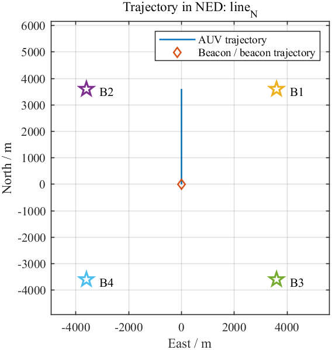

# DR_INS 现有工作梳理

生成日期：2026-08-10

## 1. 目录定位

`D:\Github\KF-GINS-Matlab\graduation\DR_INS` 当前不是单纯的 DR/INS 基础仿真目录，而是已经扩展为“DR + 距离辅助 EKF”的仿真验证目录。核心对象包括：

- DVL + 罗盘 + 深度计航位推算，即纯 DR。
- 单信标或多信标距离量测辅助 DR。
- EKF 估计 DR 误差状态，并将部分误差反馈到 DR 主状态。
- 与参考轨迹比较，输出径向误差图和结果文件。

当前目录中没有完整的惯导机械编排主流程。`imu.txt` 被数据生成脚本生成，但当前 DR/RANGE 主流程主要使用 `dvl.txt`、`compass.txt`、`depth.txt` 和 `beacon*.txt`。

## 2. 当前文件结构

```text
DR_INS/
  main_DR_RANGE.m              单信标 DR/RANGE 主程序，当前脚本存在重复循环覆盖问题
  main_DR_RANGE_4beacon.m      四信标逐信标对比主程序
  PSINS_Dr_RangeDr.m           早期 PSINS/mydr/myekf 版本的距离辅助 DR 脚本
  result_plot.m                四信标结果汇总绘图脚本，当前依赖外部变量 cfg/outputfolder
  README_DR_RANGE.txt          早期说明文件，当前显示为编码损坏状态
  function/                    当前 DR/RANGE 主要函数
  input/dataget.m              数据生成脚本
  input/data_*                 已生成的多组仿真数据与部分结果
  doc/                         本次新增的正式文档目录
  .codex/                      本次新增的过程记录目录
```

## 3. 主要工作内容

### 3.1 数据生成

入口：`input/dataget.m`

该脚本基于 PSINS 生成轨迹、IMU、DVL、罗盘、深度和信标距离数据。核心设置包括：

- 采样周期 `cfg.ts = 0.5 s`。
- AUV 速度 `cfg.v = 1 m/s`。
- 初始深度 `cfg.depth0 = 3893.066 m`。
- 初始经纬度约为 `lat0 = 30 deg`、`lon0 = 120 deg`。
- 可选轨迹：`line_N`、`line_E`、`square`、`lawnmower`、`circle`。
- 可选信标布局：`single_side`、`four_quadrants`、`triangle`、`moving_parallel` 等。
- 距离模式：当前脚本设置为 `horizontal`。
- 多信标测距调度：当前脚本设置为 `simultaneous`。

输出数据目录命名规则：

```text
input/data_<traj_case>_<beacon_case>/
```

例如：

- `input/data_line_N_single_side`
- `input/data_line_N_four_quadrants`

- `input/data_lawnmower_single_side`
- `input/data_circle_single_side`
- `input/data_square_single_side`

### 3.2 单信标 DR/RANGE

入口：`main_DR_RANGE.m`

目标流程：

1. 调用 `config_DR_RANGE(in_dir)` 读取数据路径和滤波参数。
2. 读取 `dvl.txt`、`compass.txt`、`depth.txt`、`beacon.txt`。
3. 按各传感器重叠时间区间裁剪数据。
4. 用 `DRInitialize` 初始化 DR 状态。
5. 用 `DREKFInitialize` 初始化误差状态 EKF。
6. 每个 DVL 历元执行：
   - `DRmechanization` 纯 DR 推算。
   - `DRmechanization` 组合状态推算。
   - `DRinspropagation` EKF 状态传播。
   - `DRRangeUpdate` 距离更新。
   - `DRfeedback` 误差反馈。
   - `DRWriteNavLine` 输出导航结果。
7. 调用 `calc_radial_error_gjb` 计算径向误差。

当前脚本状态：

- `in_dir` 当前指向 `input/data_line_N_single_side`。
- 距离数据被 `beacon = beacon(8:8:end,:)` 下采样。
- 脚本外层存在 `for ii = 1:4`，但输出文件名为固定的 `Origin-DR.nav`、`DR-RANGE.nav` 等，不含 `ii`。因此会重复运行并覆盖同一组输出。这个脚本目前应视为单信标实验草稿，而不是四信标批处理脚本。

### 3.3 四信标对比 DR/RANGE

入口：`main_DR_RANGE_4beacon.m`

目标流程与单信标版本类似，但输入数据目录为：

```text
input/data_line_N_four_quadrants
```

并依次读取：

- `beacon_1.txt`
- `beacon_2.txt`
- `beacon_3.txt`
- `beacon_4.txt`

输出文件按信标编号区分：

- `Origin-DR-1.nav` 到 `Origin-DR-4.nav`
- `DR-RANGE-1.nav` 到 `DR-RANGE-4.nav`

当前已有结果目录：

```text
input/data_line_N_four_quadrants/output_DR_RANGE
```

该目录已有 8 个 `.nav` 输出文件，对应四个信标的纯 DR 与距离辅助 DR 结果。

### 3.4 早期 PSINS 版本

入口：`PSINS_Dr_RangeDr.m`

这是早期基于 PSINS 自定义函数的验证脚本，依赖：

- `pvaNED2ENU`
- `mydr`
- `myekf`
- `RCompu`
- `trjsee`
- `myfigurestartup`
- `xygo`

其功能是用 `mydr` 进行航位推算，再用 `myekf` 做距离辅助。该脚本对比意义较强，但工程化程度低于当前 `function/` 下拆分后的 DR/RANGE 函数链。

### 3.5 结果绘图

入口：`result_plot.m`

当前脚本读取四信标结果并调用：

```matlab
calc_radial_error_gjb(cfg.truthpath, pathcell{:})
```

风险点：脚本中直接使用 `cfg.truthpath` 和 `outputfolder`，但本脚本自身没有定义 `cfg` 和 `outputfolder`。因此它目前需要在已有工作区变量存在时运行，不能作为独立可重复入口。

## 4. 核心函数职责

| 文件 | 职责 |
|---|---|
| `function/config_DR_RANGE.m` | 配置输入输出路径、初始位置、测距噪声、EKF 初值和反馈策略。 |
| `function/DRInitialize.m` | 初始化 DR 主状态，包括位置、姿态、速度、DVL 刻度因子和地球参数。 |
| `function/DRmechanization.m` | DVL + 罗盘 + 深度计航位推算。内部使用 PSINS 风格的 `pos=[lat lon h]`、`vn=[VE VN VU]`。 |
| `function/DREKFInitialize.m` | 初始化误差状态 EKF。默认状态为 `[dK; dYaw; dLat; dLon]`。 |
| `function/DRinspropagation.m` | DR 误差状态传播，对应早期 `myekf('fk') + myekf('algo','T')`。 |
| `function/DRRangeUpdate.m` | 单信标水平距离量测更新，构造 H、创新、S、卡尔曼增益。 |
| `function/DRfeedback.m` | 将 EKF 误差状态反馈到 DR 主状态。当前默认只反馈水平位置。 |
| `function/DRGetClosestIndex.m` | 对异步传感器数据寻找最近时间索引。 |
| `function/DRWriteNavLine.m` | 输出导航结果，默认经纬度和姿态以度写出。 |
| `function/DRNavDegToNED.m` | 将导航结果转换为局部 NED 格式，便于与 `reference.txt` 对比。 |

## 5. 当前数据集状态

| 数据集 | 轨迹/布局 | 是否已有输出 | 说明 |
|---|---|---:|---|
| `data_line_N_single_side` | 北向直线 + 单侧单信标 | 是 | 单信标 DR/RANGE 主测试数据。 |
| `data_line_N_four_quadrants` | 北向直线 + 四象限信标 | 是 | 四信标可观测性/布局对比数据。 |
| `data_lawnmower_single_side` | 割草机轨迹 + 单侧单信标 | 是 | 已有单信标输出。 |
| `data_circle_single_side` | 圆形轨迹 + 单侧单信标 | 否 | 已生成输入数据，未见输出目录。 |
| `data_square_single_side` | 方形轨迹 + 单侧单信标 | 否 | 已生成输入数据，未见输出目录。 |

## 6. 单位与坐标系

当前工程同时出现 NED、ENU 和 PSINS 内部导航表达，需要固定约定：

- `reference.txt`：`t N E D pitch roll yaw vN vE vD`。
- `dvl.txt`：`t vb_x vb_y vb_z`，体坐标速度。
- `compass.txt`：`t pitch roll yaw`，姿态角单位为 rad。
- `depth.txt`：`t depth`，深度单位 m，NED 中 D 向下为正。
- `beacon*.txt`：`t slant_range horizontal_range beacon_lat beacon_lon beacon_h`，经纬度为 rad，高程 m。
- DR 内部状态：`pos=[lat; lon; h]`，其中 `h` 向上为正；`vn=[VE; VN; VU]`；`att=[pitch; roll; yaw]`，rad。
- 导航输出 `.nav`：默认经纬度和姿态角转换为 deg。

## 7. 现有问题与整理建议

1. `README_DR_RANGE.txt` 编码损坏，建议后续以 `doc/` 下 Markdown 为准。
2. `main_DR_RANGE.m` 外层 `for ii=1:4` 与固定输出文件名冲突，会覆盖结果；单信标实验应去掉外层循环，四信标实验使用 `main_DR_RANGE_4beacon.m`。
3. `main_DR_RANGE_4beacon.m` 中 `dvl/compass/depth` 在 `for ii=1:4` 内被裁剪，后续循环使用的是已裁剪后的数据。当前数据时间范围相同可能不暴露问题，但更稳妥的做法是每个信标循环都从原始数据副本裁剪。
4. `result_plot.m` 不是独立脚本，缺少 `cfg` 和 `outputfolder` 定义。
5. `main_DR_RANGE.asv` 和 `result_plot.asv` 是 MATLAB 自动备份文件，不应作为正式入口。
6. 当前 DR/RANGE 主流程没有使用 `imu.txt` 做 INS 机械编排。若下一步目标是 DR/INS 组合，需要明确 INS 状态传播、IMU 误差模型和 DR/DVL/罗盘/深度/距离的融合架构。

## 8. 建议下一步

1. 先将 `main_DR_RANGE.m` 修正为严格单信标入口，移除无效 `for ii=1:4`。
2. 将 `main_DR_RANGE_4beacon.m` 改为函数化入口，例如 `run_DR_RANGE_4beacon(in_dir)`。
3. 修复 `result_plot.m`，让它自包含配置路径和输出目录。
4. 对 `input/dataget.m` 拆出可配置参数块，避免每次改脚本内部变量。
5. 若开展 DR/INS 仿真，新增独立 INS 主流程，不要把 IMU 机械编排混入当前 DR/RANGE 脚本。
